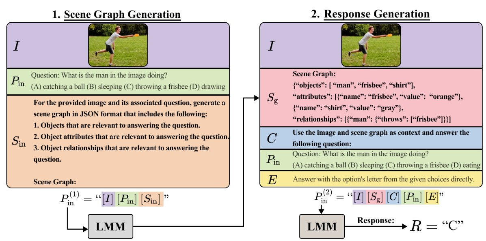

# Compositional Chain-of-Thought Prompting for Large Multimodal Models
This is an unofficial repository for [**Compositional Chain-of-Thought Prompting for Large Multimodal Models (CVPR 2024)**](https://arxiv.org/abs/2311.17076).


An exmaple from the original paper:



Our implementation use `gpt-4-vision-preview` as LMM. Since GPT-4V may answer the question in Step 1, we add "You should answer the scene graph only, and you should not answer the question." to the original prompt.

Run our demo, and you can see the following results:
```
python CCoT.py
```
Scene Graph:
```json
{
  "objects": [
    {
      "object": "man",
      "attributes": ["standing", "one leg raised", "arm extended"]
    },
    {
      "object": "frisbee",
      "attributes": ["in motion", "held by man"]
    },
    {
      "object": "grass",
      "attributes": ["green", "ground covering"]
    }
  ],
  "relationships": [
    {
      "subject": "man",
      "relation": "is on",
      "object": "grass"
    },
    {
      "subject": "man",
      "relation": "is throwing",
      "object": "frisbee"
    },
    {
      "subject": "frisbee",
      "relation": "is being thrown by",
      "object": "man"
    }
  ]
}
```
Final answer:
```
C
```
